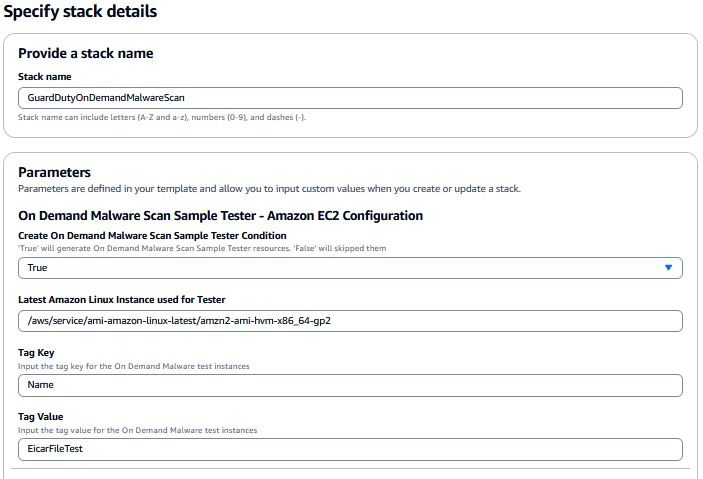
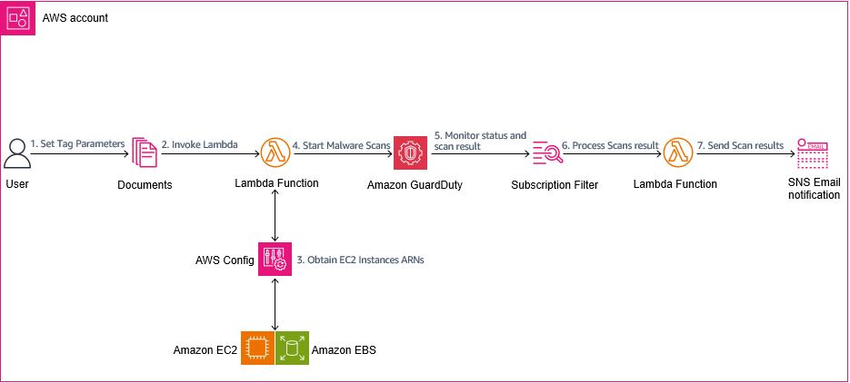
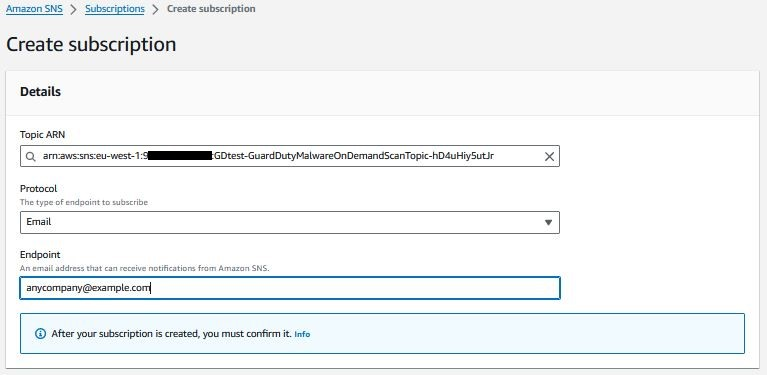
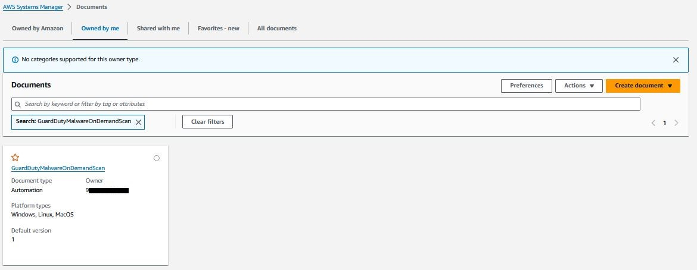
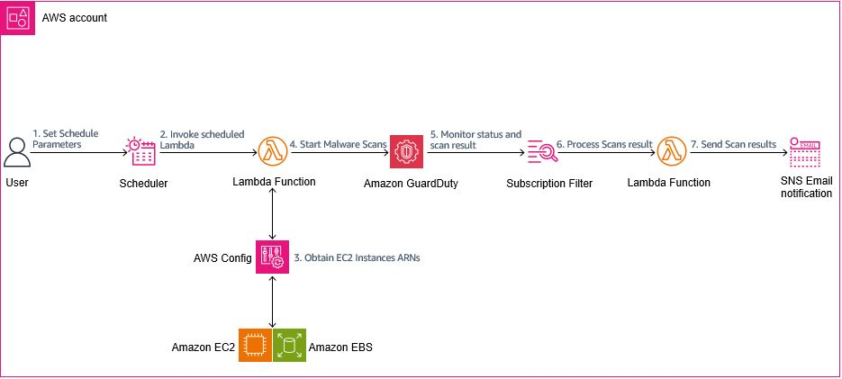
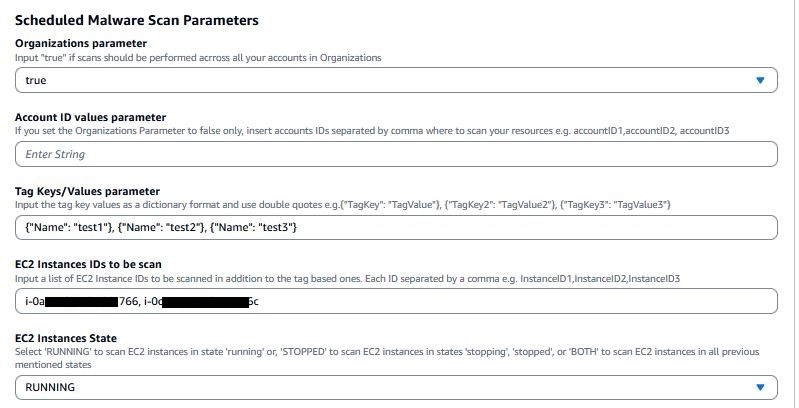

# Multi-account on-demand malware scan with Amazon GuardDuty

This solution is focused on centralize on-demand malware scans from the GuardDuty administrator account extending uses cases **1/ Initiating scans for EC2 instances with specific tags** and **2/ Initiating scans on a schedule** from the AWS Security Blog: [Four use cases for GuardDuty Malware Protection On-demand malware scan.](https://aws.amazon.com/blogs/security/four-use-cases-for-guardduty-malware-protection-on-demand-malware-scan/)

The high-level workflow is:

- Using a AWS Lambda Function, the code samples will obtain a list EC2 instances to be scanned based on their tags or EC2 instances IDs passed directly as parameter depending on the solution. The list of EC2 instances will be obtained querying **AWS Config Aggregator data**.

- Once malware scan is launched and scans are initiated, a Cloudwatch Log Subscription Filter will monitor status and scan results with the following filter:
```{$.scanRequestDetails.requestType = ON_DEMAND && ($.eventDetails.eventType = EC2_SCAN_SKIPPED) || ($.eventDetails.eventType = EC2_SCAN_COMPLETED)}.```

- Matched logs will be send to a second AWS Lambda Function that acts as a notifier using and SNS topic.

- **NOTE**. In addition to the resources created by these solutions, a CloudFormation Custom Resource will also be created. This Custom Resource constists of a Lamda Function that will run during the slack deployment. The purpose of this function is to make sure that the required "/aws/guardduty/malware-scan-events" log group exists, and to create it in case it does not. This log group is used by the GuardDuty Malware Protection feature to publish events related to the malware scan. To learn more about this specific log group, please see the following [documentation](https://docs.aws.amazon.com/guardduty/latest/ug/malware-protection-auditing-scan-logs.html).


<!-- TABLE OF CONTENTS -->
<details open="open">
  <summary>Table of Contents</summary>
  <ol>
    <li><a href="#prerequisites">Prerequisites</a></li>
    <li><a href="#malware-scan-sample-tester">Malware Scan Sample Tester</a></li>
    <li><a href="#initiating-scans-for-ec2-instances-with-specific-tags">Initiating scans for EC2 instances with specific tags</a></li>
    <li><a href="#initiating-scans-on-a-schedule">Initiating scans on a schedule</a></li>
    <li><a href="#output-examples">Output Examples</a></li>
    <li><a href="#license">License</a></li>
  </ol>
</details>

<br/>

## Prerequisites
In order to work, the following prerequisites are required:

* GuardDuty [Administrator](https://docs.aws.amazon.com/guardduty/latest/ug/guardduty_accounts.html) account enabled (region based). Scans will be lunched from this account upon EC2 instances created in its own account or instances in its member accounts. 
* Any instance that is to be scanned need to have GuardDuty service [enabled](https://docs.aws.amazon.com/guardduty/latest/ug/malware-protection.html) in its region.
* AWS Config [aggregator](https://docs.aws.amazon.com/config/latest/developerguide/aggregate-data.html) created within the same account as the GuardDuty Administrator. The automation will obtain the list of EC2 instances to scan based on advance [querying](https://docs.aws.amazon.com/config/latest/developerguide/querying-AWS-resources.html) AWS Config aggregator data. For more details on how to set up an organization-wide aggregator in AWS Config using a delegated administrator account, see this [AWS Cloud Operations & Migrations blog post](https://aws.amazon.com/blogs/mt/org-aggregator-delegated-admin/). 
* This approach follows the following multi account best practices as shown [here](https://docs.aws.amazon.com/whitepapers/latest/organizing-your-aws-environment/security-ou-and-accounts.html#security-tooling-accounts) where security tooling account is used to centralize both services GuardDuty and AWS Config.


## Optional - Malware Scan Sample Tester

Both solutions provided will allow you to create and deploy two EC2 instances to test on demand scans. The following template paramaters shown in these sections are **optional**.

These two free instances provide an example for both malware clean and infected instances. For the _"infected"_ instances we make use of the Anti Malware Testfile [eicar](https://en.wikipedia.org/wiki/EICAR_test_file) which allows to test malware scan with an infected result without having to use a real malware. **NOTE** This scan result will generate a GuardDuty High severity finding.

Both instances will live in a private subnet and allowed **only** outbound communication in order to obtain the _"eicar"_ file during launch deployment. 


### CloudFormation Stack:

**Input On Demand Malware Scan Sample Tester Amazon EC2 Configuration - Parameters**

* Create On Demand Malware Scan Sample Tester Condition. Set this value to **"True"** to deploy the tester solution. If **"False"** the tester solution and all its resources will be skipped
* Latest Amazon Linux Instance used for Tester. Leave this value as it is
* Tag Key which will be applied to both instances 
* Tag Value which will be applied to both instances 



<br/><br/><br/>

## Initiating scans for EC2 instances with specific tags

This solution allows to perform on demand scans on specific EC2 instances based on their tags or based on their volume tags through an SSM Automation document. This solution is intended to be deployed with CloudFormation and run **in the GuardDuty administrator account**.

### Diagram:



### CloudFormation Stack:

**Choose a template Section:**
* Select Prerequisite - Prepare template, specify upload a template file and choose file [OnDemandMalwareScanTagsMultiAccount.yaml](https://github.com/aws-samples/Multi-account-on-demand-malware-scan-with-Amazon-GuardDuty/blob/main/src/OnDemandMalwareScanTagsMultiAccount.yaml)

**Specify Stack details Section:**
* Add Stack Name

**Input AWS Config Parameters**
* Add _Config Aggregator Name_
* Add _region_ where your Config Aggregator exists
* **Make sure** both input values are correct


**Last Steps:**
* Review, ack IAM requirements and lunch
* Once the stack is deployed, **create and confirm an SNS email subscription** for the SNS topic created with the following name convention: _"(StackName)-GuardDutyMalwareOnDemandScanTopic-()"_





### Excute SSM automation document:
* In the GuardDuty administrator account where document has been deployed, enter SSM Documents **owned by me** section and search for **GuardDutyMalwareOnDemandScan**


* Or you can also enter the document dirctly from the outputs section of the CloudFormation stack.


* Execute the automation, follow the document Runbook description and input required the parameters as shown in this snapshot, then execute.


<br/><br/><br/>


## Initiating scans on a schedule

This solution allows to perform on demand scheduled scans on specific EC2 instances based on their tags or/and directly to EC2 instances which IDs are passed manually as an input parameter.

This solution uses [Amazon EventBridge Scheduler](https://docs.aws.amazon.com/eventbridge/latest/userguide/scheduler.html) to set reccurent scans with scheduling capability and is intended to be deployed with CloudFormation and run in the **GuardDuty administrator account**.


### Diagram:


### CloudFormation Stack:

**Choose a template Section:**
* Select Prerequisite - Prepare template, specify upload a template file and choose file [OnDemandMalwareScheduledScanMultiAccount.yaml](https://github.com/aws-samples/Multi-account-on-demand-malware-scan-with-Amazon-GuardDuty/blob/main/src/OnDemandMalwareScheduledScanMultiAccount.yaml)


**Specify Stack details Section:**
* Add Stack Name

**Input Scheduled Malware Scan Parameters**
* Organizations parameter. Set to _"true"_ if scans should be performed across all accounts in Organizations
* Account ID values parameter. **If you set** the Organizations Parameter to _false_ only, insert accounts IDs separated by comma where to scan your resources e.g.
```accountID1,accountID2, accountID3```
* Tag Keys/Values parameter. Input the tag key values as a dictionary format and use double quotes e.g:
```{"TagKey": "TagValue"}, {"TagKey2": "TagValue2"}, {"TagKey3": "TagValue3"}```
* EC2 Instances IDs to be scan. Input a list of EC2 Instance IDs to be scanned in addition to the tag based ones. Each ID separated by a comma e.g:
```InstanceID1,InstanceID2,InstanceID3```
* EC2 Instances State. Select **'RUNNING'** to scan EC2 instances in state _'running'_ or, **'STOPPED'** to scan EC2 instances in states _'stopping', 'stopped',_ or **'BOTH'** to scan EC2 instances in all previous mentioned states




**Input AWS Scheduler Parameters**
* Rate for the schedule scan to be run. Input the schedule rate e.g. _days, weeks, minutes, hours_.
* First time scheduled scan will run. Input a date in UTC format, related to Time Zone parameter. **NOTE** this value is required to be set after current time
* Time Zone. Input a valid zone value, for reference [here](https://docs.aws.amazon.com/scheduler/latest/UserGuide/schedule-types.html#time-zones)


**Input AWS Config Parameters**
* Add _Config Aggregator Name_
* Add _region_ where your Config Aggregator exists
* **Make sure** both input values are correct


**Last Steps:**
* Review, ack IAM requirements and lunch
* Once the stack is deployed, **create and confirm an SNS email subscription** to the SNS topic created with the following name convention: _"(StackName)-GuardDutyMalwareOnDemandScheduledScanTopic-()_". See the Amazon SNS subscription set up steps in the first example for guidance on setting up a subscription for receiving the results.


<br/><br/><br/>


## Output Examples

**1)** Example of a **clean result**
<br/><br/>

<br/><br/>

**2)** Example of an **infected result**
<br/><br/>

><br/>

**3)** EC2 instance has already been scanned during the last hour.
<br/>

<br/>

**4)** No instance was found that could be scanned.
<br/>

<br/>

**5)** If GuardDuty was not enabled on the instance account/region, you will face the following error.
<br/>

<br/>


## Authors
- [Eduardo Ortiz Pineda](https://www.linkedin.com/in/eduardo-ortiz-pineda-a38b1a11a)
- [Rodrigo Ferroni](https://linkedin.com/in/rferroni)


## License
This script is licensed under the MIT-0 License. See the [LICENSE](https://github.com/aws-samples/Multi-account-on-demand-malware-scan-with-Amazon-GuardDuty/blob/main/LICENSE) file.
